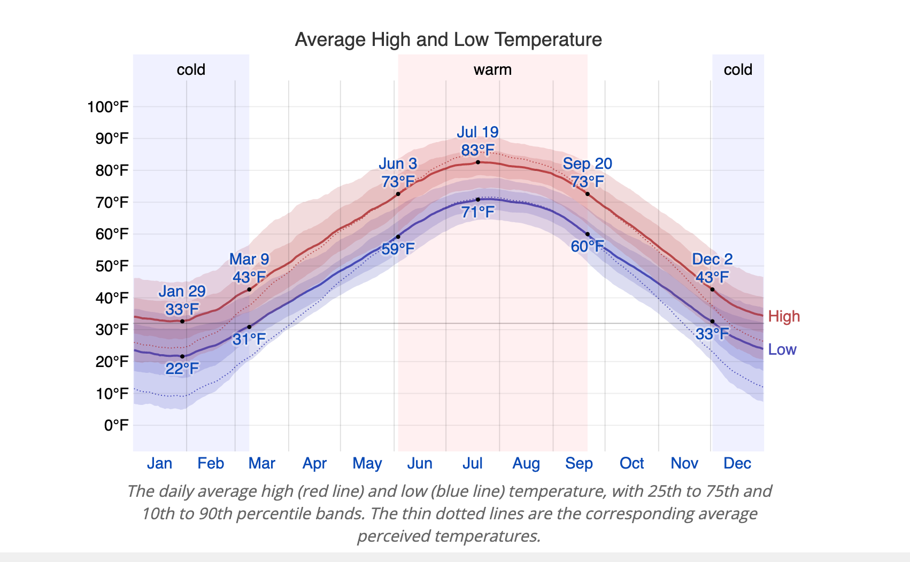
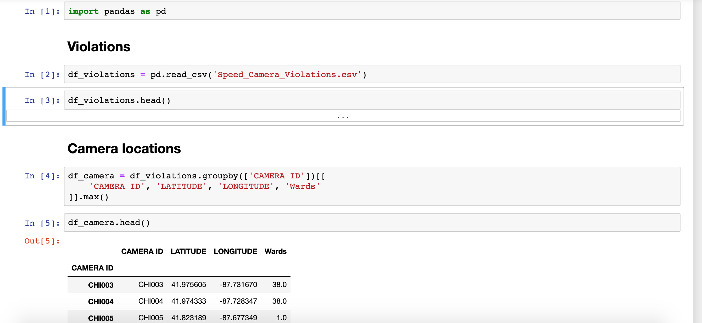

# Project Overview

The topic for the individual project is the City of Chicago’s Automated Speed Enforcement Program, and the project is to transform Speed Camera Violations in Chicago dataset into visualizations. The project is divided into three parts  Data Exploration, First Version, Revised Version.  

The first version of the project is visualizing three aspects of the data in an interesting, non-trivial, and somewhat unexpected fashion to the mayor of Chicago and giving proper analysis based on the aspects. Additionally, giving some road-map with future features or enhancements.

# Dataset Information

## Speed Camera Violations Dataset  

This dataset reflects the daily volume of violations that have occurred in Children's Safety Zones for each speed camera. The data reflects violations that occurred from July 1, 2014 until present, but not including the most recent 14 days. This data may change due to occasional time lags between the capturing of a potential violation and the processing and determination of a violation. The most recent 14 days are not shown due to revised data being submitted to the City of Chicago. The reported violations are those that have been collected by the camera and radar system and reviewed by two separate City contractors.

The City ordinance establishing the Children’s Safety Zone program substantially narrows the hours and locations of automated speed enforcement that are allowed under state law, and provides for the following 
* The enforcement hours will be limited from 7 a.m. to 7 p.m. in safety zones around schools on school days (Monday through Friday)
* The enforcement hours around parks will be limited to only those hours parks are open (typically 6 a.m. to 11 p.m., 7 days a week) with a 30 mph speed limit

## Speed Camera Violations with Crime Dataset  

This dataset reflects reported incidents of crime (with the exception of murders where data exists for each victim) that occurred in the City of Chicago from 2015 to 2018. Data is extracted from the Chicago Police Department's CLEAR (Citizen Law Enforcement Analysis and Reporting) system. The dataset is merged Year of 2015-2018's crime datasets orginally comes from Chicago Data Portal website. Each case number represents total number of crime by each wards.

# Developing process  

1 - Playaround with data 
* Redownloading the data from Chicago data portal.There are some new variables have been added to the dataset such as Community area, Wards.  
* Checking data validity. For example, Zipcode is not a correct data of Chicago zipcode.
* Clarifying different variable meaning;Understanding each row represents for.
* Checking each variable type(e.g. string, float and etc). 

2 - Literature inspiration 
* In order to better understand the data and find different aspects, searching some references (news, article, paper, journal, vedios) related to speed camera violation in Chicago.

3 - Insert data into tableau 
* Trying differenct variable combination with violation numbers to find findings.

4 - Analysising on the different findings.  

5 - Showing findings to Chicago Mayor with evidences.

6 - Limitation and improvement of findings

# Finding Analysis 

## Finding 1   
The graph clearly show that daily average speed violation number decreases year by year.  
  

### Data wrangling steps   
**Step 1**  I conceptually think that with speed camera installation, drivers behavior will change, and the violation numbers will change by time. So I checked the relatioship between violation numbers and each year.  

**Step 2**  Year 2014 and 2019 are not complete year, instead of using total number of violation by year, I choose to use daily average violation as row.  

**Step 3**  I used line chart to represent the data first. However, even it clearly shows the trend, it is hard to compare different year's violation numbers. So I changed the graph to bar chart, and it much clearly to show trend and each year's difference.

### Analysis   
The reason may come from Chicago speed camera in differenct safety zone. The speed camera is changing driver's behavior in these locations. On the other hand, with less violation numbers,accident injury by automobiles will decrease in these area. So government expense on ambulance, hospital expense will be less.  

However, an article named 'CHICAGO’S LATEST MONEY GRAB  300 SPEED CAMERAS COULD GENERATE UP TO $4.3 BILLION IN FINES FROM LOCAL MOTORISTS' in illinois policy website,violation tickets fine is a major money collection for government. So less violations will cause less ticket fines and decrease government income. 

## Finding 2   
The higheset violation number by each month usually happened in May or October for each year, and August is always the low point between May and October.  

### Data wrangling steps   
**Step 1**  After found yearly violation trend is decreasing, I also want to check whether month has effect on violation numbers.

**Step 2**  Because year 2014 and 2019 are not complete data, I filter the data only include whole calendar year from 2015-2018.

**Step 3**  I use bar chart first to make the plot and sort by sum violation number descending. However, the finding is not that obvious. It only can figure out May is the highest violation month from 2015-2017, but Octorber became the highest violation number on 2018.  

**Step 4**  Line chart' is used to see changes over the short and long term, and it can show even small changes over time. Because I want to see the montly trend for each year, and when I change to it, the trend is very clear.  

### Analysis   
After did some reasearches, there are two possible reasons to cause this happened.

First, based on the 'Average Weather in Chicago report on Weather Spark', Chicago's weather temperature become warmer on May, get hotter on July and August, become warmer again on October. When the weather get better, the road situation getting better. For example, there will be less snowing or raining. People have higher opportunity to drive faster. Moreover, because the speed cameras are located on school and park zone, more people will hang out to play when weather getting better. The opportunity to get speed violation increase.  

Second, one potential reason to cause August has low point is that majority schools have summer break during July and August, there will be less children and parents in children safety zone during these time. On the other hand, because Auguest is still pretty hot in Chicago, less people will visit park comparing to better warm weather months.  

In order to sovle the high violation issue, I would suggust Chicago government to double the fine during warm weather month. With higher fine, people will be more careful to pass children safety zone and decrease automobile injuries. 

### Finding 3   
In each ward, number of crimes is not positively correlated to the number of speeding violations. In wards with low crime numbers, the number of speeding violations seem to be randomly distributed. In wards with high crime numbers, the number of crimes and number of speeding violations seem to be negatively correlated.  

### Data wrangling steps   
**Step 1**  Besides time trend with violation numbers relationship, I also want to know whether the violations are affected by neiborhood enviornments. The first variable comes to my mind is income. However, I only find Year of 2017's Chicago average income. Because the data is not representable, I drop this idea.  

**Step 2**  I download Year 2015-2018 Chicago crime dataset on Chicago data portal. Choosing year 2015-2018 because it is the complete academic year and it is more representable.

**Step 3**  I use Python to merge 2015-2018 Chicago crime dataset with speed camera violation dataset by Wards.  

**Step 4**  In the new merged dataset in Tableau, each case number represents total number of crime by each wards.The pictures shows the merge steps writing in Jupyter notebook with Python. I also upload the complete file in github.  

 

**Step 5**  I used bar chart to make the plot first. However, many bars overlap together, the graph looks really messy. 

**Step 6**  On PM Study Circle website, it illustrates "scatter plot shows the relationship between two variables. It is the best method to show you a non-linear pattern. The range of data flow, i.e. maximum and minimum value, can be easily determined." And I want to find whether violation numbers are correlated with crime numbers, I realized that scatter plot is a better choice. As a result, I got an unexpected finding.  

### Analysis   
The result is really unexpected. One possible reason is that, there are more police officers on duty in high crime wards. Many drivers, being aware of this situation, tent to pay more attention to their speed when driving through these regions.

The finding is very useful. Some people might have sugguested that high crime number regions need more speed cameras. This finding suggests the opposite. 

# Road-map with future features/enhancements 

1. The date range of data is very limited - we have only three full calendar years. For example, if data from more years is available, I should be able to build better visualizations to demonstrate my findings such as time trend with violation numbers.  

2. By collecting more dimentions of the data - for example the age and gender of the drivers, the model and registration place of the vehicles, the illumination condition, the locations of the speed signs - I will be able to find more insights on the cause of speed violations, and give more suggestions to the audience.  

3. After taking the data visualization class, I should have a better understanding on different types of visualizations and thus build better ones for my findings from the violation data.

# Tableau Public Link  
https://public.tableau.com/profile/xinran.li7719#!/vizhome/First_version/Dashboard1

# References  

1. "Children's Safety Zone Program & Automated Speed Enforcement." chicago.gov, www.chicago.gov/city/en/depts/cdot/supp_info/children_s_safetyzoneporgramautomaticspeedenforcement.html. 

2. "Average Weather in Chicago." Weather Spark, 
https://weatherspark.com/y/14091/Average-Weather-in-Chicago-Illinois-United-States-Year-Round#Sections-Temperature

3. "CHICAGO'S LATEST MONEY GRAB: 300 SPEED CAMERAS COULD GENERATE UP TO $4.3 BILLION IN FINES FROM LOCAL MOTORISTS." illinoispolicy, 21 Aug. 2013, www.illinoispolicy.org/chicagos-latest-money-grab-300-speed-cameras-could-generate-up-to-4-3-billion-in-fines-from-local-motorists/. 

4. Usmani, Fahad. "What is a Scatter Diagram (Correlation Chart)?" PM Study Circle, 23 July 2018, https://pmstudycircle.com/2014/08/what-is-a-scatter-diagram-correlation-chart/

# Dataset source

The original datasets of Chicago crime from year 2015-2018 and Chicago speeding camera violation are too big, and it is hard to upload here. Here is the link to datasets:  

Crime dataset:  
https://data.cityofchicago.org/Public-Safety/Crimes-2015/vwwp-7yr9  
https://data.cityofchicago.org/Public-Safety/Crimes-2018/3i3m-jwuy  
https://data.cityofchicago.org/Public-Safety/Crimes-2016/kf95-mnd6  
https://data.cityofchicago.org/Public-Safety/Crimes-2017/d62x-nvdr  
               
Speed camera violation: https://data.cityofchicago.org/Transportation/Speed-Camera-Violations/hhkd-xvj4
